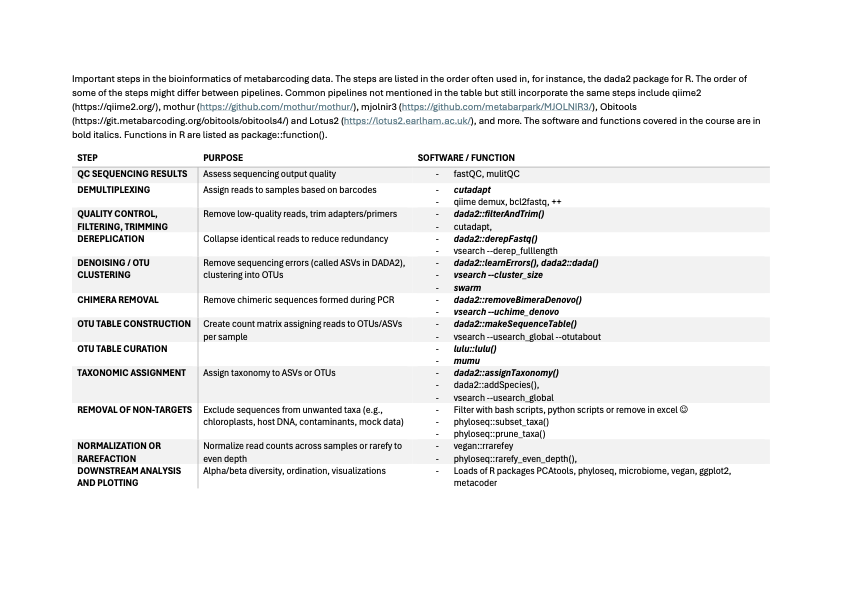

### Monday
- [Introduction to DNA metabarcoding](./Lecture_pdfs/Intro%20lecture%20revised.pdf) Håvard Kauserud
- [Introduction to sequencing techniques](../Lectures/Lecture_pdfs/Seq_tech_Krabberod_v25.pdf). Anders K. Krabberød
- [Group work](./Lecture_pdfs/Groups.pdf)
- [Introduction to Linux](../Lectures/Intro.to.unix/) - Ramiro Logares
- [Introduction to Google Colab](../Lectures/Intro.to.colab/) - R. Logares 
- [Introduction to R](../Lectures/intro.to.R/) - R. Logares
- [Sequence cleaning](../Lectures/cutadapt.and.seq.cleaning/)
### Tuesday
- [DADA2 lecture](./Lecture_pdfs/DADA2_lecture_V25.pdf) - A.K. Krabberød
  - [DADA2 pipeline](../Dada2_Pipeline/)
- Case study
### Wednesday
- Introduction to long-read DNA metabarcoding. Embla Stokke
- Introduction to VSEARCH and Swarm. Torbjørn Rognes
- Hands-on with VSEARCH and Swarm. R. Logares, A.K. Krabberød
- Introduction to LULU/MUMU. Frédéric Mahé
### Thursday
- Phylogenetic placement - L. Czeck
- [PR2, metaPR2 + other databases](./Lecture_pdfs/2025-04-10%20PR2-UiO%20course.pdf). Daniel Vaulot
- Equating OTUs with Species Diversity - M. Dunthorn
- 
### Friday
- Taxonomic Assignment - M. Davey
- Introduction to Metacoder - E. Thoen
- Networks - A. Krabberød
- Downstream analyses - R. Logares

# Main steps of a typical metabarcoding analysis:

  