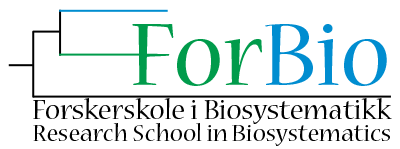

# BIO9905MERG1 - V25
This is the future home of the course BIO9905MERG1 - V25. The course will be held 7-11 April 2025. 

For the course page on the University of Oslo [webpage, click here](https://www.uio.no/studier/emner/matnat/ibv/BIO9905MERG1/).

## Course content
For mapping and exploring communities of both micro- and macroorganisms, high throughput sequencing (HTS) of environmental DNA has become a powerful approach. One can either analyze the total DNA content to obtain knowledge about which genes are present (DNA metagenomics) or sequence a selected PCR-amplified marker (DNA metabarcoding) to obtain information about the taxonomic composition. We will focus on the latter approach in this course. The students will be introduced to important analytical bioinformatics approaches from the processing of raw sequence data to establishment of the OTU/sample matrix and retrieval of taxonomic identity of the sequences.

Important themes will be (1) filtering and quality assessment of high throughput sequence data, (2) error correction and/or clustering of high throughput sequence data, and (3) taxonomic annotation of high throughput sequence data. We will also touch upon some further downstream analyses, including network analyses and evolutionary placement of HTS onto backbone phylogenies. Applications of a wide suite of tools will be presented, including VSEARCH and DADA2.

The course will be a blend of presentations, guest lectures, discussion and a few hands-on sessions. All hands-on secession will be run in R on your local laptop/computer. Hence, all participants should have R and selected R packages installed – see information below.

## Schedule

The course will run from 7-11 April, 9:00-17:00 (times may vary). For a detailed overview of the program, see below.

## Report
Those of you that attend the course through the research schools or UiO and want to obtain ECTS credits, will have to hand in a report before June 1th.
For the report, you should write a 3-page text (minimum) about a fictive research project where you will use DNA-metabarcoding to explore the community composition and diversity of a certain habitat and/or ecological gradient. You are free to select the organismal group(s) and the habitat/gradient. In the text you should: (1) define the goal(s) of the study, (2) describe the sampling design, (3) the wet-lab work (briefly) and, most important, (4) the bioinformatics analyses. Not only describe how you plan to carry out the research, but also why you make your choices. On point (4), describe in detail how you plan to analyze your data and which bioinformatics approaches you will use and why. Also mentioned what you expect to be problematic and which steps that might introduce bias(es) to your results, as well as what type of bias(es). Concerning the format, you should use Times New Roman size 12, 1.5 line spacing and 2.5 cm margins.

The report should be sent to: haavarka@ibv.uio.no

## Teachers
The main teachers will be Ramiro Logares, Anders K. Krabberød, Micah Dunthorn, and Håvard Kauserud (organizer). Other teachers will be announced soon.

*Tentative schedule* for the course (subject to change):

| Day           | Time (start) | Topic                                                                                                                                                                                         | Responsible             |
| ------------- | ------------ | --------------------------------------------------------------------------------------------------------------------------------------------------------------------------------------------- | ----------------------- |
| **Monday**    | 09:00        | [Introduction to DNA metabarcoding](./Lectures/Lecture_pdfs/Intro%20lecture%20revised.pdf)                                                                                                    | Håvard Kauserud         |
|               | 10:00        | *Introduction continued*                                                                                                                                                                      |                         |
|               | 11:00        | [Introduction to DNA sequencing techniques and data formats ](./Lectures/)                                                                                                                    | Anders K. Krabberød     |
|               | 12:00        | **Lunch break**                                                                                                                                                                               |                         |
|               | 13:00        | [ Get to know each other (group work)](./Lectures/Lecture_pdfs/Groups.pdf)                                                                                                                    | Håvard Kauserud         |
|               | 14:00        | [Introduction to Linux, Google Colab, R, cutadapt, etc ](./Lectures)                                                                                                                          | Ramiro Logares          |
|               | 15:00        | *continued*                                                                                                                                                                                   |                         |
|               | 16:00        | *continued*                                                                                                                                                                                   |                         |
|               | 17:00        | **PIZZA**                                                                                                                                                                                     |                         |
|               |              |                                                                                                                                                                                               |                         |
| **Tuesday**   | 09:00        | [Introduction to DADA2, R and Rstudio](Dada2_Pipeline)                                                                                                                                        | A. K. Krabberød         |
|               | 10:00        | *DADA2, R, Rstudio continued*                                                                                                                                                                 |                         |
|               | 11:00        | *DADA2, R, Rstudio continued*                                                                                                                                                                 |                         |
|               | 12:00        | **Lunch break**                                                                                                                                                                               |                         |
|               | 13:00        | [Case study:Long-read metabarcoding of tropical marine protist communities: insights of the seasonality in equatorial waters](./Lectures/Lecture_pdfs/Denise_metaB%20course-case%20study.pdf) | Denise Ong Rui Ying     |
|               | 14:00        | *Case study continued*                                                                                                                                                                        |                         |
|               | 14:00        | *DADA2 and R hands-on*                                                                                                                                                                        | A. Krabberød            |
|               | 15:00        | *DADA2 and R hands-on*                                                                                                                                                                        |                         |
|               | 16:00        | *DADA2 and R hands-on*                                                                                                                                                                        |                         |
|               |              |                                                                                                                                                                                               |                         |
| **Wednesday** | 09:00        | [Introduction to long-read DNA metabarcoding](./Lectures/Lecture_pdfs/Intro_to_LRM_v2.pdf)                                                                                                                                                   | Embla Stokke            |
|               | 10:00        | [Introduction to VSEARCH (and SWARM)](./Lectures/Lecture_pdfs/bio9901merg1-2025-vsearch-swarm.pdf)                                                                                            | Torbjørn Rognes         |
|               | 11:00        | The VSEARCH pipeline, hands on  session                                                                                                                                       | R. Logares/A. Krabberød |
|               | 12:00        | **Lunch break**                                                                                                                                                                               |                         |
|               | 13:00        | The VSEARCH pipeline, hands on jam session, continued                                                                                                                                         | R. Logares/A. Krabberød |
|               | 14:00        | [Introduction to LULU/MUMU](./Lectures/Lecture_pdfs/mahe_lulu_olso_2025.pdf)                                                                                                                                                                    | Frédéric Mahé           |
|               | 15:00        | Data cleanup (contamination, etc.)                                                                                                                                                            | Håvard Kauserud         |
|               |              |                                                                                                                                                                                               |                         |
| **Thursday**  | 09:00        | [OTUs, ASVs and phylospecies](./Lectures/Lecture_pdfs/clustering_talk_Oslo_2025.pdf)                                                                                                                                                                  | Micah Dunthorn          |
|               | 10:00        | [PR2, metaPR2 + other databases](./Lectures/Lecture_pdfs/2025-04-10%20PR2-UiO%20course.pdf)                                                                                                   | Daniel Vaulot           |
|               | 11:00        | *PR2 continued*                                                                                                                                                                               |                         |
|               | 12:00        | **Lunch break**                                                                                                                                                                               |                         |
|               | 13:00        | [Phylogenetic placement/binning of HTS data](./Lectures/./Lecture_pdfs/phylogenetic-placement.pdf)                                                                                                                                                    | Lucas Czech             |
|               | 14:00        | *Phylogenetic placement continued*                                                                                                                                                            |                         |
|               | 15:00        | [Case study long read metabarcoding: Exploring Archaeorhizomycetes diversity...](./Lectures/Lecture_pdfs/Archies_spring2025_ELLA_THOEN.pdf)                                                                                                                                                            | Ella Thoen              |
|               | 16:00        |                                                                                                                                                                                               |                         |
|               |              |                                                                                                                                                                                               |                         |
| **Friday**    | 09:00        | [Taxonomic annotation](./Lectures/Lecture_pdfs/metabarcoding_course_taxonomic_assignment_11042025.pdf)                                                                                                                                                                          | Marie Davey (zoom)      |
|               | 10:00        | [Metacoder](./Lectures/Metacoder/)                                                                                                                                                                                     | Ella Thoen              |
|               | 11:00        | DNA metabarcoding and contamination                                                                                                                                                           | Kristine Bohmann (zoom) |
|               | 12:00        | **Lunch break**                                                                                                                                                                               |                         |
|               | 13:00        | [Downstream analyses: community ecology](./Lectures/community.ecology.intro/)                                                                                                                                                   | R. Logares              |
|               | 14:00        | [Downstream analyses: Network inferences](./Lectures/Lecture_pdfs/Networks_Bio9905_V25.pdf)                                                                                                                                                       | A. Krabberød            |
|               | 15:00        | Summing up, QnA                                                                                                                                                                               | *Tutti*                 |
|               |              |                                                                                                                                                                                               |                         |

 ----
### Supported by[ ForBio](https://www.forbio.uio.no/)
   
  
> [!CAUTION]
> All the keywords in this explanation, by the way, are totally misleading, due to the everyday quirks of language.
**Don DeLillo, Ratner's Star**.
